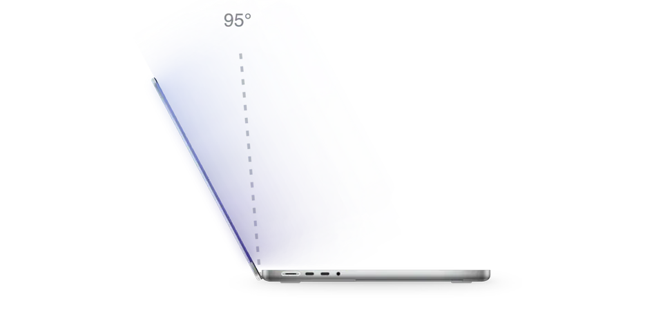

<div align="center">


# Softfold

**ふたを閉じると、デスクトップがやわらかく折りたたまれる。**

<a href="https://github.com/ReffWu/softfold/releases/latest/download/Softfold.dmg">
  <picture>
    <source media="(prefers-color-scheme: dark)" srcset="docs/readme/download-ja-dark.png">
    
  </picture>
</a>

<p>
  <a href="https://trendshift.io/repositories/237288?utm_source=trendshift-badge&amp;utm_medium=badge&amp;utm_campaign=badge-trendshift-237288" target="_blank" rel="noopener noreferrer"></a>
</p>

<sub>無料 · Apple シリコン搭載 MacBook · macOS 14 以降 · Apple による公証済み</sub>

<sub>Softfold を気に入ったら GitHub で ⭐ を付けてください。より多くの人が見つけやすくなります。</sub>

[English](README.md) · [简体中文](README.zh-CN.md) · [繁體中文](README.zh-TW.md) · 日本語 · [한국어](README.ko.md) · [Deutsch](README.de.md) · [Français](README.fr.md) · [Español](README.es.md) · [Italiano](README.it.md) · [Português](README.pt-BR.md) · [Русский](README.ru.md) · [Nederlands](README.nl.md) · [Türkçe](README.tr.md) · [Polski](README.pl.md) · [العربية](README.ar.md) · [Tiếng Việt](README.vi.md)

</div>

<p align="center">
  <picture>
    <source media="(prefers-color-scheme: dark)" srcset="docs/readme/hero-ja-dark.webp">
    
  </picture>
</p>

---

Softfold は MacBook のヒンジに合わせて動きます。画面を倒していくと、ライブのデスクトップも一緒に後ろへ傾き、上から少しずつぼやけて、両側の暗がりに溶けていきます。もう一度開けば、すべてがくっきりと元の場所に戻ります。

## ダウンロード

[Softfold.dmg をダウンロード](https://github.com/ReffWu/softfold/releases/latest/download/Softfold.dmg)して開き、Softfold を「アプリケーション」へドラッグしてください。Developer ID で署名され、Apple の公証を受けているので、ほかのアプリと同じように開けます。

初回起動時に「画面収録」を許可し、macOS に求められたら Softfold を開き直してからオンにしてください。以降は Mac の起動時に自動で立ち上がり、オンのまま使えます。

初めてオンにしたときのふたの角度が、開いた角度として設定されます。あとから変えるときは、好みの位置にふたを合わせて **現在の角度を使用** をクリックします。<kbd>⌃</kbd> <kbd>⌥</kbd> <kbd>H</kbd> でどこからでもオン/オフできます。

## 対応している MacBook

Softfold には、Apple が 2019 年から搭載しているふたの角度センサー（Apple シリコン機ではセンサー用コプロセッサ経由）と、macOS 14 以降が必要です。センサーがない Mac では、Softfold がそのことを知らせます。

| 状況 | 機種 |
| --- | --- |
| 動作確認済み | 14 / 16 インチ MacBook Pro：M1 Pro または M1 Max（2021）、M2 Max（2023）、M3 Pro または M3 Max（2023）、M4 Pro または M4 Max（2024）。MacBook Air：M4（2025）または M5 |
| センサーあり、未確認 | 14 インチ MacBook Pro：M3、M4、M5。14 / 16 インチ MacBook Pro：M5 Pro または M5 Max。MacBook Air：M2 または M3 |
| 非対応 | M1 MacBook Air、すべての 13 インチ MacBook Pro（Intel、M1、M2）、Intel MacBook Pro、12 インチ MacBook、MacBook Neo、デスクトップ Mac |

2019 年の 16 インチ MacBook Pro にもセンサーはありますが、配布しているアプリは Apple シリコン専用です。

わからないときは「ターミナル」で次のコマンドを実行してください。`las` で終わる行があれば、Softfold はふたの角度を読み取れます。

```sh
hidutil list --matching '{"VendorID":0x5ac,"PrimaryUsagePage":32,"PrimaryUsage":138}'
```

表のまん中の機種で試した方は、ぜひ[結果を教えてください](https://github.com/ReffWu/softfold/issues)。

## しくみ

Softfold は IOKit HID でふたの角度を読み取ります。センサーが対応していれば 0.01 度単位で、やみくもにポーリングするのではなく、センサー自身の更新タイミングに合わせて読みます。臨界減衰フィルターがその値をなめらかな動きに変えます。ゆっくり倒せばゆっくり、すばやく倒せばすばやく折れます。途中で 1 秒止めるとデスクトップのピントがなめらかに戻り、さらに閉じればすぐにまた折れます。

ScreenCaptureKit がライブのデスクトップを取り込み、Metal が遠近、段階的なぼかし、両側の塗りを 60 fps で描画します。画面の取り込みはふたを閉じている間と折りたたまれている間だけ行い、開いてから数秒で止まるので、画面収録のインジケーターも消えます。映像は Mac のメモリ内にだけ置かれ、録画やアップロードは一切しません。使用中の Mac の台数を数えるため、Softfold は1日に1回匿名のハートビートを送ります。内容はランダムなインストール ID、App と macOS のバージョン、Mac のモデル、その日に折りたたみを使ったかどうかだけです。画面の内容、ファイル、IP アドレス、個人情報は保存しません。Softfold のウインドウで「匿名の使用状況統計を共有」をオフにすると止まります。

動きの設計の詳細は [MOTION.md](MOTION.md) にあります。

## 言語

英語、簡体字中国語、繁体字中国語、日本語、韓国語、ドイツ語、フランス語、スペイン語、イタリア語、ブラジルポルトガル語、ロシア語、オランダ語、トルコ語、ポーランド語、アラビア語、ベトナム語に対応しています。Mac の言語設定に従うほか、Softfold のウインドウで個別に選べます。

## ソースからビルド

Xcode をインストールしてから：

```sh
git clone https://github.com/ReffWu/softfold.git
cd softfold
make build
open build/Softfold.app
```

開発用のチェックは [CHECKS.md](CHECKS.md)、署名付きリリースの手順は [RELEASE.md](RELEASE.md) を参照してください。

## コントリビュート

アイデア、バグ報告、プルリクエストを歓迎します。[Issue を作成](https://github.com/ReffWu/softfold/issues)するか、PR を送ってください。

## クレジット

Softfold は Noveum.ai の [Hinge](https://github.com/Noveum/hinge)（MIT ライセンス）のフォークから始まりました。ふたの角度センサーの HID 識別子とレポート形式は [LidAngleSensor](https://github.com/samhenrigold/LidAngleSensor) で初めて公開されました。

## ライセンス

[MIT](LICENSE)
