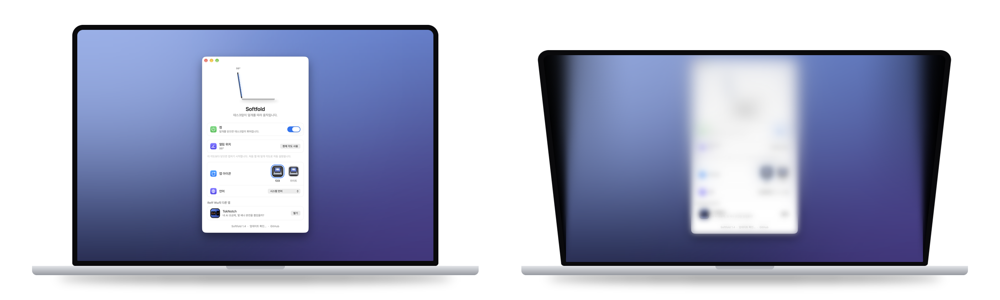

<div align="center">


# Softfold

**덮개를 닫으면, 데스크톱이 부드럽게 접힙니다.**

<a href="https://github.com/ReffWu/softfold/releases/latest/download/Softfold.dmg">
  <picture>
    <source media="(prefers-color-scheme: dark)" srcset="docs/readme/download-ko-dark.png">
    
  </picture>
</a>

<sub>무료 · Apple 실리콘 MacBook · macOS 14 이상 · Apple 공증 완료</sub>

<sub>Softfold가 마음에 드신다면 GitHub에서 ⭐를 눌러 주세요. 더 많은 사람이 찾을 수 있습니다.</sub>

[English](README.md) · [简体中文](README.zh-CN.md) · [繁體中文](README.zh-TW.md) · [日本語](README.ja.md) · 한국어

</div>

<p align="center">
  
</p>

---

Softfold는 MacBook의 힌지를 따라 움직입니다. 화면을 내리면 실시간 데스크톱도 함께 뒤로 기울어지고, 위에서부터 서서히 흐려지며 양옆의 어둠 속으로 스며듭니다. 다시 열면 모든 것이 선명하게, 두고 간 그 자리로 돌아옵니다.

## 다운로드

[Softfold.dmg 다운로드](https://github.com/ReffWu/softfold/releases/latest/download/Softfold.dmg) 후 열어서 Softfold를 응용 프로그램 폴더로 드래그하세요. Developer ID로 서명되고 Apple의 공증을 받았기 때문에 다른 앱처럼 바로 열립니다.

처음 실행할 때 화면 기록을 허용하고, macOS가 요청하면 Softfold를 다시 연 뒤 켜세요. 이후에는 Mac을 켤 때 자동으로 실행되고 켜진 상태를 유지합니다.

처음 켤 때의 덮개 각도가 열림 각도로 설정됩니다. 나중에 바꾸려면 원하는 위치에 덮개를 두고 **현재 각도 사용**을 클릭하세요. <kbd>⌃</kbd> <kbd>⌥</kbd> <kbd>H</kbd>로 어디서든 켜고 끌 수 있습니다.

## 지원하는 MacBook

Softfold에는 Apple이 2019년부터 넣기 시작한 덮개 각도 센서(Apple 실리콘 기기에서는 센서 보조 프로세서를 통해 제공)와 macOS 14 이상이 필요합니다. 센서가 없는 Mac이라면 Softfold가 알려 줍니다.

| 상태 | 모델 |
| --- | --- |
| 사용자 확인 완료 | 14, 16인치 MacBook Pro: M1 Pro 또는 M1 Max(2021), M2 Max(2023), M3 Pro 또는 M3 Max(2023), M4 Pro 또는 M4 Max(2024). MacBook Air: M4(2025) 또는 M5 |
| 센서 있음, 아직 미확인 | 14인치 MacBook Pro: M3, M4, M5. 14, 16인치 MacBook Pro: M5 Pro 또는 M5 Max. MacBook Air: M2 또는 M3 |
| 지원 안 함 | M1 MacBook Air, 모든 13인치 MacBook Pro(Intel, M1, M2), Intel MacBook Pro, 12인치 MacBook, MacBook Neo, 데스크톱 Mac |

2019년 16인치 MacBook Pro에도 센서가 있지만, 배포되는 앱은 Apple 실리콘 전용입니다.

잘 모르겠다면 터미널에서 아래 명령을 실행해 보세요. `las`로 끝나는 줄이 있으면 Softfold가 덮개 각도를 읽을 수 있습니다.

```sh
hidutil list --matching '{"VendorID":0x5ac,"PrimaryUsagePage":32,"PrimaryUsage":138}'
```

표 가운데 줄의 모델에서 사용해 보셨다면 [결과를 알려 주세요](https://github.com/ReffWu/softfold/issues).

## 작동 방식

Softfold는 IOKit HID로 덮개 각도를 읽습니다. 센서가 지원하면 0.01도 단위로, 무작정 폴링하지 않고 센서 자체의 갱신 주기에 맞춰 읽습니다. 임계 감쇠 필터가 그 값을 연속적인 움직임으로 바꿉니다. 천천히 기울이면 천천히, 빠르게 기울이면 빠르게 접힙니다. 중간에 1초 멈추면 데스크톱이 부드럽게 다시 선명해지고, 계속 닫으면 곧바로 다시 접힙니다.

ScreenCaptureKit이 실시간 데스크톱을 가져오고, Metal이 원근, 점진적 흐림, 양옆 채우기를 60fps로 렌더링합니다. 화면 캡처는 덮개를 닫는 동안이나 접혀 있을 때만 실행되고, 다시 열고 몇 초 뒤에 멈추므로 화면 기록 표시도 사라집니다. 화면은 Mac의 메모리에만 머물며 녹화나 업로드는 전혀 하지 않습니다. 사용 중인 Mac 수를 세기 위해 Softfold는 하루에 한 번 익명 하트비트를 보냅니다. 내용은 임의의 설치 ID, 앱과 macOS 버전, Mac 모델, 그날 접기 효과를 썼는지 여부뿐입니다. 화면 내용, 파일, IP 주소, 개인 정보는 저장하지 않습니다. Softfold 윈도우에서 '익명 사용 통계 공유'를 끄면 멈춥니다.

움직임 설계의 자세한 내용은 [MOTION.md](MOTION.md)에 있습니다.

## 언어

영어, 중국어 간체, 중국어 번체, 일본어, 한국어, 독일어, 프랑스어, 스페인어, 이탈리아어, 브라질 포르투갈어, 러시아어, 네덜란드어, 튀르키예어, 폴란드어, 아랍어, 베트남어를 지원합니다. Mac의 언어 설정을 따르며, Softfold 창에서 따로 고를 수도 있습니다.

## 소스에서 빌드

Xcode를 설치한 뒤:

```sh
git clone https://github.com/ReffWu/softfold.git
cd softfold
make build
open build/Softfold.app
```

개발 검사는 [CHECKS.md](CHECKS.md), 서명된 릴리스 절차는 [RELEASE.md](RELEASE.md)를 참고하세요.

## 기여하기

아이디어, 버그 제보, 풀 리퀘스트 모두 환영합니다. [이슈를 열거나](https://github.com/ReffWu/softfold/issues) PR을 보내 주세요.

## 크레딧

Softfold는 Noveum.ai의 [Hinge](https://github.com/Noveum/hinge)(MIT 라이선스)를 포크해서 시작했습니다. 덮개 각도 센서의 HID 식별자와 리포트 형식은 [LidAngleSensor](https://github.com/samhenrigold/LidAngleSensor)에서 처음 공개되었습니다.

## 라이선스

[MIT](LICENSE)
