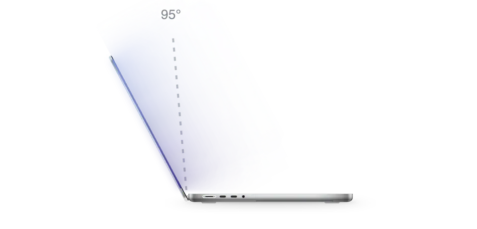

<div align="center">


# Softfold

**合上屏幕，桌面温柔地折叠起来。**

<a href="https://github.com/ReffWu/softfold/releases/latest/download/Softfold.dmg">
  <picture>
    <source media="(prefers-color-scheme: dark)" srcset="docs/readme/download-zh-Hans-dark.png">
    
  </picture>
</a>

<p>
  <a href="https://trendshift.io/repositories/237288?utm_source=trendshift-badge&amp;utm_medium=badge&amp;utm_campaign=badge-trendshift-237288" target="_blank" rel="noopener noreferrer"></a>
</p>

<sub>免费 · Apple 芯片 MacBook · macOS 14 或更新版本 · 经 Apple 公证</sub>

<sub>喜欢 Softfold 的话，在 GitHub 上点个 ⭐，能让更多人发现它。</sub>

[English](README.md) · 简体中文 · [繁體中文](README.zh-TW.md) · [日本語](README.ja.md) · [한국어](README.ko.md) · [Deutsch](README.de.md) · [Français](README.fr.md) · [Español](README.es.md) · [Italiano](README.it.md) · [Português](README.pt-BR.md) · [Русский](README.ru.md) · [Nederlands](README.nl.md) · [Türkçe](README.tr.md) · [Polski](README.pl.md) · [العربية](README.ar.md) · [Tiếng Việt](README.vi.md)

</div>

<p align="center">
  <picture>
    <source media="(prefers-color-scheme: dark)" srcset="docs/readme/hero-zh-Hans-dark.webp">
    
  </picture>
</p>

---

Softfold 会跟着 MacBook 的铰链一起动。你把屏幕往下合，实时的桌面也跟着向后倾倒，从上往下逐渐模糊，慢慢融进两侧的暗色里。再把屏幕抬起来，一切原样回来，清清楚楚，停在你离开时的样子。

## 下载

[下载 Softfold.dmg](https://github.com/ReffWu/softfold/releases/latest/download/Softfold.dmg)，打开后把 Softfold 拖进「应用程序」。App 使用 Developer ID 签名并经过 Apple 公证，像其他 App 一样双击就能打开。

第一次启动时允许「屏幕录制」，如果 macOS 要求就重新打开 Softfold，然后把它开启。之后它会随 Mac 自动启动，并保持开启状态。

第一次开启时，Softfold 会自动取你当时的屏幕角度作为打开角度。之后想改，把屏幕调到舒服的位置，点 **使用当前角度** 就行。在任何地方按 <kbd>⌃</kbd> <kbd>⌥</kbd> <kbd>H</kbd> 都能开启或关闭它。

## 哪些 MacBook 可以用

Softfold 需要 Apple 从 2019 年开始加入的屏幕开合角度传感器（在 Apple 芯片机型上由传感器协处理器提供），以及 macOS 14 或更新版本。如果你的 Mac 没有这个传感器，Softfold 会直接告诉你。

| 状态 | 机型 |
| --- | --- |
| 可用，已有用户确认 | 14 和 16 英寸 MacBook Pro：M1 Pro 或 M1 Max（2021）、M2 Max（2023）、M3 Pro 或 M3 Max（2023）、M4 Pro 或 M4 Max（2024）。MacBook Air：M4（2025）或 M5 |
| 有传感器，尚未确认 | 14 英寸 MacBook Pro：M3、M4 或 M5。14 和 16 英寸 MacBook Pro：M5 Pro 或 M5 Max。MacBook Air：M2 或 M3 |
| 不支持 | M1 MacBook Air、所有 13 英寸 MacBook Pro（Intel、M1、M2）、Intel MacBook Pro、12 英寸 MacBook、MacBook Neo、台式 Mac |

2019 年的 16 英寸 MacBook Pro 也有这个传感器，但发布的 App 只支持 Apple 芯片。

不确定？在「终端」里运行下面这条命令，如果输出里有一行以 `las` 结尾，就说明 Softfold 能读到你的屏幕角度：

```sh
hidutil list --matching '{"VendorID":0x5ac,"PrimaryUsagePage":32,"PrimaryUsage":138}'
```

用的是表格中间那一行的机型？欢迎[告诉我们结果](https://github.com/ReffWu/softfold/issues)。

## 工作原理

Softfold 通过 IOKit HID 读取屏幕角度，传感器支持时精确到百分之一度，并且跟着传感器自己的刷新节奏读取，而不是盲目地高频轮询。一个临界阻尼滤波器把这些读数变成连续的动作：慢慢合，就慢慢折；快快合，就快快折。合到一半停下一秒，桌面会柔和地恢复清晰；继续往下合，又会立刻折起来。

ScreenCaptureKit 提供实时桌面画面，Metal 以 60 fps 渲染透视、渐进模糊和两侧填充。只有在合盖或已经折叠时才会截屏，屏幕打开几秒后就停止，屏幕录制的提示图标也会随之消失。画面只保留在你 Mac 的内存里，不录制、不上传。为了统计有多少台 Mac 在使用，Softfold 每天发送一次匿名心跳，内容只有随机生成的安装 ID、App 和 macOS 版本、Mac 型号，以及当天是否用过折叠效果。不会保存屏幕内容、文件、IP 地址或任何个人信息。在 Softfold 窗口里关闭「共享匿名使用统计」即可停止。

完整的动效设计见 [MOTION.md](MOTION.md)。

## 语言

支持英语、简体中文、繁体中文、日语、韩语、德语、法语、西班牙语、意大利语、巴西葡萄牙语、俄语、荷兰语、土耳其语、波兰语、阿拉伯语和越南语。默认跟随系统语言，也可以在 Softfold 窗口里单独选择。

## 从源码构建

先安装 Xcode，然后：

```sh
git clone https://github.com/ReffWu/softfold.git
cd softfold
make build
open build/Softfold.app
```

开发检查见 [CHECKS.md](CHECKS.md)，签名发布流程见 [RELEASE.md](RELEASE.md)。

## 参与贡献

欢迎提想法、报 Bug、发 Pull Request。可以[提交 Issue](https://github.com/ReffWu/softfold/issues) 或直接发 PR。

## 致谢

Softfold 最初 fork 自 Noveum.ai 的 [Hinge](https://github.com/Noveum/hinge)，原项目以 MIT 许可证发布。屏幕角度传感器的 HID 标识和报告格式最早由 [LidAngleSensor](https://github.com/samhenrigold/LidAngleSensor) 公开。

## 许可证

[MIT](LICENSE)
