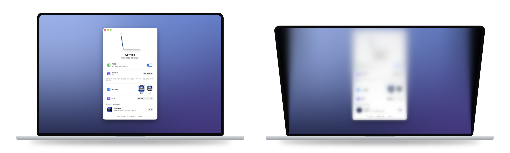

<div align="center">


# Softfold

**闔上螢幕，桌面溫柔地摺疊起來。**

<a href="https://github.com/ReffWu/softfold/releases/latest/download/Softfold.dmg">
  <picture>
    <source media="(prefers-color-scheme: dark)" srcset="docs/readme/download-zh-Hant-dark.png">
    
  </picture>
</a>

<sub>免費 · Apple 晶片 MacBook · macOS 14 或更新版本 · 經 Apple 公證</sub>

[English](README.md) · [简体中文](README.zh-CN.md) · 繁體中文 · [日本語](README.ja.md) · [한국어](README.ko.md)

</div>

<p align="center">
  
</p>

---

Softfold 會跟著 MacBook 的鉸鏈一起動。你把螢幕往下闔，即時的桌面也跟著向後傾倒，從上往下逐漸模糊，慢慢融進兩側的暗色裡。再把螢幕掀起來，一切原樣回來，清清楚楚，停在你離開時的樣子。

## 下載

[下載 Softfold.dmg](https://github.com/ReffWu/softfold/releases/latest/download/Softfold.dmg)，打開後把 Softfold 拖進「應用程式」。App 使用 Developer ID 簽署並經過 Apple 公證，和其他 App 一樣點兩下就能打開。

第一次啟動時允許「螢幕錄製」，如果 macOS 要求就重新打開 Softfold，然後把它開啟。之後它會隨 Mac 自動啟動，並保持開啟狀態。

第一次開啟時，Softfold 會自動取你當時的螢幕角度作為開啟角度。之後想改，把螢幕調到舒服的位置，按 **使用目前角度** 就行。在任何地方按 <kbd>⌃</kbd> <kbd>⌥</kbd> <kbd>H</kbd> 都能開啟或關閉它。

## 哪些 MacBook 可以使用

Softfold 需要 Apple 從 2019 年開始加入的螢幕開合角度感測器（在 Apple 晶片機型上由感測器協同處理器提供），以及 macOS 14 或更新版本。如果你的 Mac 沒有這個感測器，Softfold 會直接告訴你。

| 狀態 | 機型 |
| --- | --- |
| 可用，已有使用者確認 | 14 和 16 吋 MacBook Pro：M1 Pro 或 M1 Max（2021）、M2 Max（2023）、M3 Pro 或 M3 Max（2023）、M4 Pro 或 M4 Max（2024）。MacBook Air：M4（2025）或 M5 |
| 有感測器，尚未確認 | 14 吋 MacBook Pro：M3、M4 或 M5。14 和 16 吋 MacBook Pro：M5 Pro 或 M5 Max。MacBook Air：M2 或 M3 |
| 不支援 | M1 MacBook Air、所有 13 吋 MacBook Pro（Intel、M1、M2）、Intel MacBook Pro、12 吋 MacBook、MacBook Neo、桌上型 Mac |

2019 年的 16 吋 MacBook Pro 也有這個感測器，但發佈的 App 只支援 Apple 晶片。

不確定？在「終端機」裡執行下面這行指令，如果輸出裡有一行以 `las` 結尾，就代表 Softfold 讀得到你的螢幕角度：

```sh
hidutil list --matching '{"VendorID":0x5ac,"PrimaryUsagePage":32,"PrimaryUsage":138}'
```

用的是表格中間那一列的機型？歡迎[告訴我們結果](https://github.com/ReffWu/softfold/issues)。

## 運作原理

Softfold 透過 IOKit HID 讀取螢幕角度，感測器支援時精確到百分之一度，並且跟著感測器自己的更新節奏讀取，而不是盲目地高頻輪詢。一個臨界阻尼濾波器把這些讀數變成連續的動作：慢慢闔，就慢慢摺；快快闔，就快快摺。闔到一半停下一秒，桌面會柔和地恢復清晰；繼續往下闔，又會立刻摺起來。

ScreenCaptureKit 提供即時桌面畫面，Metal 以 60 fps 繪製透視、漸進模糊和兩側填充。只有在闔上或已經摺疊時才會擷取畫面，螢幕打開幾秒後就停止，螢幕錄製的提示圖示也會跟著消失。畫面只留在你 Mac 的記憶體裡，不錄影、不上傳。為了統計有多少台 Mac 在使用，Softfold 每天傳送一次匿名心跳，內容只有隨機產生的安裝 ID、App 和 macOS 版本、Mac 機型，以及當天是否用過摺疊效果。不會儲存螢幕內容、檔案、IP 位址或任何個人資訊。在 Softfold 視窗裡關閉「分享匿名使用統計」即可停止。

完整的動態設計請見 [MOTION.md](MOTION.md)。

## 語言

支援英文、簡體中文、繁體中文、日文、韓文、德文、法文、西班牙文、義大利文、巴西葡萄牙文、俄文、荷蘭文、土耳其文、波蘭文、阿拉伯文和越南文。預設跟隨系統語言，也可以在 Softfold 視窗裡另外選擇。

## 從原始碼建置

先安裝 Xcode，然後：

```sh
git clone https://github.com/ReffWu/softfold.git
cd softfold
make build
open build/Softfold.app
```

開發檢查請見 [CHECKS.md](CHECKS.md)，簽署發佈流程請見 [RELEASE.md](RELEASE.md)。

## 參與貢獻

歡迎提供想法、回報 Bug、送出 Pull Request。可以[建立 Issue](https://github.com/ReffWu/softfold/issues) 或直接送 PR。

## 致謝

Softfold 最初 fork 自 Noveum.ai 的 [Hinge](https://github.com/Noveum/hinge)，原專案以 MIT 授權發佈。螢幕角度感測器的 HID 識別碼和報告格式最早由 [LidAngleSensor](https://github.com/samhenrigold/LidAngleSensor) 公開。

## 授權

[MIT](LICENSE)
