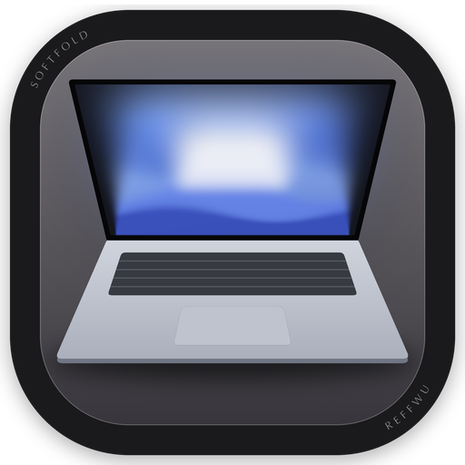
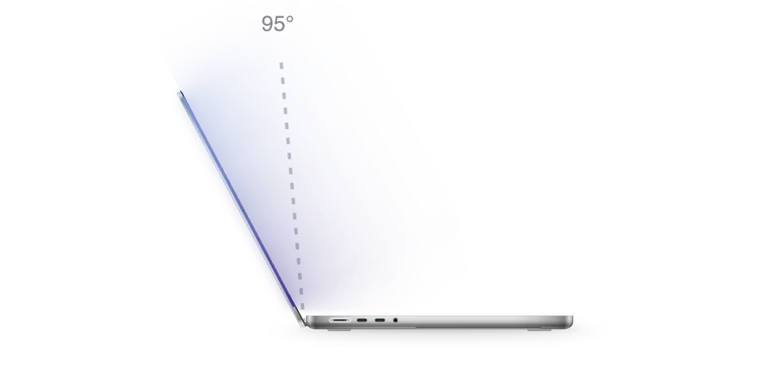

<div align="center">



# Softfold

**स्क्रीन झुकाएं, और आपका डेस्कटॉप हौले से मुड़ जाता है।**

<a href="https://github.com/ReffWu/softfold/releases/latest/download/Softfold.dmg">
  <picture>
    <source media="(prefers-color-scheme: dark)" srcset="../readme/download-en-dark.png">
    
  </picture>
</a>

<p>
  <a href="https://trendshift.io/repositories/237288?utm_source=trendshift-badge&amp;utm_medium=badge&amp;utm_campaign=badge-trendshift-237288" target="_blank" rel="noopener noreferrer"></a>
</p>

<sub>निःशुल्क · Apple Silicon युक्त MacBook · macOS 14 या नया · Apple द्वारा सत्यापित</sub>

<sub>यदि आपको Softfold पसंद आए, तो GitHub पर एक ⭐ इसे दूसरों तक पहुंचाने में मदद करेगा।</sub>

[English](../../README.md) · [简体中文](../../README.zh-CN.md) · हिन्दी · [🌍 सभी भाषाएँ](README.md)

</div>

<p align="center">
  <picture>
    <source media="(prefers-color-scheme: dark)" srcset="../readme/hero-en-dark.webp">
    
  </picture>
</p>

---

Softfold आपके MacBook के हिंज के साथ तालमेल बिठाकर चलता है। जैसे ही आप स्क्रीन को नीचे करते हैं, आपका लाइव डेस्कटॉप उसके साथ पीछे की ओर झुकता है, ऊपर से नीचे की ओर धीरे-धीरे धुंधला होता है और किनारों के अंधेरे में विलीन हो जाता है। स्क्रीन को फिर से उठाएं, और सब कुछ बिल्कुल स्पष्ट रूप से वहीं लौट आता है जहां आपने छोड़ा था।

## डाउनलोड

[Softfold.dmg डाउनलोड करें](https://github.com/ReffWu/softfold/releases/latest/download/Softfold.dmg), फ़ाइल खोलें और Softfold को Applications फ़ोल्डर में खींचें। ऐप Developer ID से हस्ताक्षरित है और Apple द्वारा नोटरीकृत है, इसलिए यह अन्य मूल Mac ऐप्स की तरह सुरक्षित रूप से खुलता है।

पहली बार खोलने पर सिस्टम सेटिंग्स में «स्क्रीन रिकॉर्डिंग» की अनुमति दें, यदि macOS संकेत दे तो ऐप को पुनः खोलें और चालू करें। इसके बाद यह आपके Mac के चालू होने पर स्वचालित रूप से शुरू हो जाएगा।

पहली बार चालू करने पर Softfold स्क्रीन के मौजूदा कोण को खुलने का कोण मान लेता है। बाद में इसे बदलने के लिए स्क्रीन को अपने पसंदीदा कोण पर रखें और **वर्तमान कोण का उपयोग करें** पर क्लिक करें। <kbd>⌃</kbd> <kbd>⌥</kbd> <kbd>H</kbd> शॉर्टकट से आप प्रभाव को कभी भी चालू या बंद कर सकते हैं।

## समर्थित MacBook मॉडल

Softfold के लिए ढक्कन के कोण वाले सेंसर की आवश्यकता होती है जिसे Apple ने 2019 से पेश किया है (Apple Silicon पर सेंसर को-प्रोसेसर के माध्यम से उपलब्ध) और macOS 14 या नया संस्करण। यदि आपके Mac में यह सेंसर नहीं है, तो Softfold आपको तुरंत बता देता है।

| स्थिति | मॉडल |
| --- | --- |
| कार्यशील, उपयोगकर्ताओं द्वारा पुष्ट | M1 Pro या M1 Max (2021), M2 Max (2023), M3 Pro या M3 Max (2023), M4 Pro या M4 Max (2024) वाले 14" और 16" MacBook Pro। M4 (2025) या M5 वाले MacBook Air |
| सेंसर उपलब्ध, अभी पुष्ट नहीं | M3, M4 या M5 वाले 14" MacBook Pro। M5 Pro या M5 Max वाले 14" और 16" MacBook Pro। M2 या M3 वाले MacBook Air |
| समर्थित नहीं | M1 वाले MacBook Air, सभी 13" MacBook Pro (Intel, M1 और M2), Intel आधारित MacBook Pro, 12" MacBook, MacBook Neo, डेस्कटॉप Mac |

2019 के 16-इंच MacBook Pro में भी यह सेंसर है, लेकिन जारी किया गया ऐप विशेष रूप से Apple Silicon के लिए बनाया गया है।

निश्चिंत नहीं हैं? Terminal में यह कमांड चलाएं। «las» पर समाप्त होने वाली पंक्ति का अर्थ है कि Softfold आपके ढक्कन को पढ़ सकता है:

```sh
hidutil list --matching '{"VendorID":0x5ac,"PrimaryUsagePage":32,"PrimaryUsage":138}'
```

क्या आपने मध्य पंक्ति के किसी मॉडल पर आज़माया है? [अपने अनुभव हमारे साथ साझा करें](https://github.com/ReffWu/softfold/issues)।

## यह कैसे काम करता है

Softfold IOKit HID के माध्यम से ढक्कन के कोण को डिग्री के सौवें हिस्से की सटीकता के साथ पढ़ता है। एक गंभीर रूप से नम फिल्टर (critically damped filter) इन गणनाओं को एक स्वाभाविक और निरंतर गति में बदल देता है। धीमी गति - कोमल मोड़। तेज़ गति - तुरंत प्रतिक्रिया। यदि आप बीच में एक सेकंड के लिए रुकते हैं, तो डेस्कटॉप धीरे से अपनी स्पष्टता वापस पा लेता है, और जैसे ही आप बंद करना जारी रखते हैं फिर से मुड़ने लगता है।

ScreenCaptureKit वास्तविक समय डेस्कटॉप दृश्य प्रदान करता है और Metal इंजन 60 fps की स्थिर दर पर 3D परिप्रेक्ष्य और धुंधलेपन को प्रस्तुत करता है। स्क्रीन कैप्चर केवल गति के दौरान या मुड़ी हुई स्थिति में सक्रिय रहता है और पुनः खुलने के कुछ सेकंड बाद बंद हो जाता है। फ्रेम्स केवल आपके Mac की RAM में रहते हैं और कभी भी सहेजे या अपलोड नहीं किए जाते हैं। दिन में एक बार Softfold सक्रिय उपकरणों की संख्या का अनुमान लगाने के लिए एक अनाम संकेत भेजता है। कोई भी स्क्रीन सामग्री, फ़ाइलें, IP पते या व्यक्तिगत डेटा एकत्र नहीं किया जाता है। आप इसे कभी भी ऐप विंडो से बंद कर सकते हैं।

संपूर्ण गति डिजाइन [MOTION.md](../../MOTION.md) में प्रलेखित है।

## स्रोत कोड से निर्माण करें

Xcode स्थापित करें और चलाएं:

```sh
git clone https://github.com/ReffWu/softfold.git
cd softfold
make build
open build/Softfold.app
```

विकास जांच [CHECKS.md](../../CHECKS.md) में और हस्ताक्षरित रिलीज [RELEASE.md](../../RELEASE.md) में वर्णित हैं।

## योगदान

सुझाव, बग रिपोर्ट और पुल अनुरोधों का सदैव स्वागत है। [Issue खोलें](https://github.com/ReffWu/softfold/issues) या pull request भेजें।

## आभार

Softfold की शुरुआत MIT लाइसेंस के तहत Noveum.ai के [Hinge](https://github.com/Noveum/hinge) के फोर्क के रूप में हुई थी। ढक्कन सेंसर पहचानकर्ताओं को पहली बार [LidAngleSensor](https://github.com/samhenrigold/LidAngleSensor) परियोजना द्वारा प्रलेखित किया गया था।

## लाइसेंस

[MIT](../../LICENSE)
